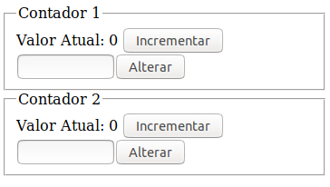

# Exercício 03

## Objetivos

* Fixar nosso conhecimento dos elementos básicos do angular
  * Componentes
  * Diretivas
  * Servicos
  * Injeção de dependências
  * Pipes
  * Rotas

## Requisitos
Aparência:



Criar um componente de nome `Contador` que:

- tenha uma propridade `nome` e exiba ela na página;
- mostra o valor atual de um contador;
- um botão que incrementa em 1 o valor do contador;
- um *input* que somente aceita números;
- um botão que altera o valor do contador com o *input* acima
- o valor exibido pelo componente deve ser encapsulado num serviço a parte com nome `ContadorService`

Criar um componente:

- colocar nele dois `ContadorComponent`

- Após terminar altere para que o próprio componente `ContadorComponent` faça o provider do `ContadorService` e observe os efeitos dessas alteração.

## Resposta

### deixe a aplicação executando

```
npm start
```

### abra o terminal e gere os arquivos necessários

```
# container para colocar os contadores
ng g component ex3/exercicio3

# criar o componente contador
ng g component ex3/contador

# criar um servico para encapsular o contador
ng g service ex3/contador

# criar uma diretiva para deixar apenas numeros sejam inseridos
ng g directive ex3/sonumeros
```

A aplicação deve ter esses arquivos:
```
├── app.component.css
├── app.component.html
├── app.component.spec.ts
├── app.component.ts
├── app.module.ts
├── ex3
│   ├── contador
│   │   ├── contador.component.css
│   │   ├── contador.component.html
│   │   ├── contador.component.spec.ts
│   │   └── contador.component.ts
│   ├── contador.service.spec.ts
│   ├── contador.service.ts
│   ├── exercicio3
│   │   ├── exercicio3.component.css
│   │   ├── exercicio3.component.html
│   │   ├── exercicio3.component.spec.ts
│   │   └── exercicio3.component.ts
│   ├── sonumeros.directive.spec.ts
│   └── sonumeros.directive.ts
└── introducao
    ├── introducao.component.css
    ├── introducao.component.html
    └── introducao.component.ts
```

#### Serviço que gerencia o contador

Basicamente precisamos definir uma propriedade pública para guardar o valor e um método para incrementá-lo.

Altere o arquivo `src/app/ex3/contador.service.ts`

```javascript
import { Injectable } from '@angular/core';

@Injectable({
  providedIn: 'root'
})
export class ContadorService {
  valor = 0;
  incrementar() {
    this.valor++;
  }
}
```

#### Mostrar/gerenciar um contador

- precisamos de uma propriedade nome:
```javascript
@Input() nome: string;
```

- precisamos alterar o valor do contador, precisamos de uma propriedade para fazermos um two-way databind na página
```javascript
novoValor: number;
```

- precisamos injetar o servico do contador no componente:
```javascript
constructor(private contador: ContadorService) { }
```

- precisamos que o template acesse o valor do contador que está no serviço. Vamos definir um método acessor.
```javascript
get valor(): number {
  return this.contador.valor;
}
```

- precisamos de métodos para incrementar e alterar o valor do contador:
```javascript
  incrementarValor() {
    this.contador.incrementar();
  }

  alterarValor() {
    this.contador.valor = this.novoValor;
  }
```

- resumindo altere o arquivo `src/app/ex3/contador/contador.component.ts` para:
```javascript
import { ContadorService } from './../contador.service';
import { Component, Input } from '@angular/core';

@Component({
  selector: 'app-contador',
  templateUrl: './contador.component.html',
  styleUrls: ['./contador.component.css'],
})
export class ContadorComponent {
  @Input() nome: string;

  novoValor: number;

  constructor(private contador: ContadorService) { }

  get valor(): number {
    return this.contador.valor;
  }

  incrementarValor() {
    this.contador.incrementar();
  }

  alterarValor() {
    this.contador.valor = this.novoValor;
  }
}

```

Para o template do contador devemos:

- Mostrar o nome do contador. Vamos usar o elemento `fieldset` e fazer uma interpolação no elemento `legend`

```html
<fieldset>
  <legend>{{nome}}</legend>
  <!-- ... -->
</fieldset>
```

- mostrar o valor atual
```html
Valor Atual: {{valor}}
```

- botão para icrementar o valor. Façamos um bind para o evento `click` chamando o método que definimos anteriormente no componente.
```html<button (click)="incrementarValor()">Incrementar</button>
```

- possibilitar que o valor do contador seja alterado. Vamos criar um input text fazendo um two way data binding com a propriedade do componente `novoValor`. Coloque no input a diretiva que irá evitar que sejam digitados caracteres não numéricos. Obs. Por enquanto ela não faz isso ainda.
```html
<input size="5" appSonumeros type="text" [(ngModel)]="novoValor">
```html


- alterar o valor digitado através do bind com o evento click de um botão
```html
<button (click)="alterarValor()">Alterar</button>
```

- Resumindo, altere o `src/app/ex3/contador/contador.component.html`
```html
<fieldset>
  <legend>{{nome}}</legend>
  Valor Atual: {{valor}}
  <button (click)="incrementarValor()">Incrementar</button>

  <div>
    <input size="5" appSonumeros type="text" [(ngModel)]="novoValor">
    <button (click)="alterarValor()">Alterar</button>
  </div>
</fieldset>
```

#### Diretiva para filtrar caracteres somente numéricos
- para filtrar os caracteres digitados no campo texto, precisamos interceptar o evento de tecla pressionada. Se não for um caractere de 0 a 9 fazemos o browser dispensar o evento.
```javascript
  @HostListener('keydown', ['$event'])
  onKeyDown(e: KeyboardEvent) {
    if ('0123456789'.indexOf(e.key) === -1) {
      e.preventDefault();
    }
  }
```
